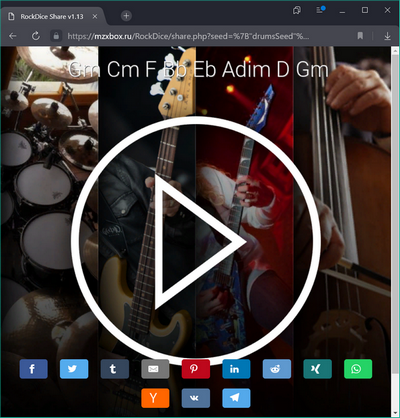
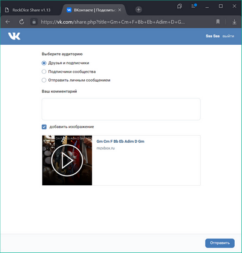

# Автогенерация музыки без AI

Автоматическое создание музыки по заданным параметрам.

Start App launcher - https://surikov.github.io/rockdice/main.html

Source - https://github.com/surikov/rockdice

Содержание:

- [Описание работы](#Описание%20работы)
  - [Похожие проекты](#Похожие%20проекты)
  - [Настройки](#Настройки)
  - [История](#История)
  - [Публикация и экспорт](#Публикация%20и%20экспорт)
- [Описание реализации](#Описание%20реализации)
  - [Воспроизведение звука](#Воспроизведение%20звука)
  - [Модуляция фрагментов](#Модуляция%20фрагментов)
  - [Специфика инструментов](#Специфика%20инструментов)
  - [Хранение состояний](#Хранение%20состояний)
  - [Разметка ссылок](#Разметка%20ссылок)
  - [Android](#Android)

# Описание работы

В основном окне можно слайдером выбрать прогрессию.

## Похожие проекты

## Настройки

## История

## Публикация и экспорт

# Описание реализации

## Воспроизведение звука

## Модуляция фрагментов

## Специфика инструментов

## Хранение состояний

## Разметка ссылок

## Android

[test](#test)

Главное окно

BandLab Songstarter
https://www.youtube.com/watch?v=EDRPy8KtY0c

Cassio
https://www.youtube.com/watch?v=Aepm6V4yvhw

Настройки

Выбор фрагмента

Выбор прогрессии

История

Экспорт

Публикация

https://www.bandlab.com/sss1024/tracks

# test
kkkk

