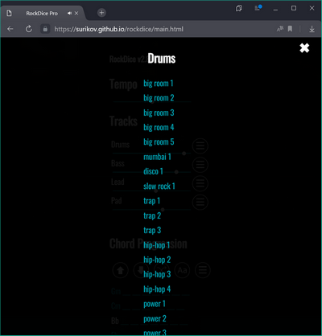

# rockdice

- Start App launcher - https://surikov.github.io/rockdice/main.html
- Source - https://github.com/surikov/rockdice

# Автогенерация музыки без AI


Автоматическое создание музыки по заданным параметрам.

- Открыть в браузере - https://surikov.github.io/rockdice/main.html
- Исходники - https://github.com/surikov/rockdice
- Андроидная версия - https://play.google.com/store/apps/details?id=rockdice.chord.progression

Используется Web Audio API, TypeScript, Android WebView, таблично-волновой синтез и элементарная теория музыки.

---

Содержание:

- [Описание работы](#Описание%20работы)
  - [Похожие проекты](#Похожие%20проекты)
  - [Настройки](#Настройки)
  - [История](#История)
  - [Публикация и экспорт](#Публикация%20и%20экспорт)
- [Описание реализации](#Описание%20реализации)
  - [Воспроизведение звука](#Воспроизведение%20звука)
  - [Модуляция фрагментов](#Модуляция%20фрагментов)
  - [Специфика инструментов](#Специфика%20инструментов)
  - [Хранение состояний](#Хранение%20состояний)
  - [Разметка ссылок](#Разметка%20ссылок)
  - [Android](#Android)

# Описание работы


В основном окне можно слайдером выбрать прогрессию. Последовательность аккордов определяет настроение мелодии (слева минорные, справа мажорные, посередине джазовые септаккорды).
Круглыми переключателями можно выбрать риффы для стандартных 4-х слоёв мелодии
- Drums - задает ритм
- Bass - гармоническая основа и ритм
- Lead - создаёт мелодический рисунок
- Pad - контрапункт, протяжные ноты показывающие функцию аккорда

По голубой кнопке с игральным кубиком выбираются рандомные значения.

Приложение делает модуляцию выбранных фрагментов под заданные аккорды. Если покрутить переключатели и прослушать несколько мелодий, можно убедиться что при любом сочетании аккордов и инструментов звучание результата получается вполне "человеческое".

## Похожие проекты

Встроенные функции автогенерации аранжировок появились ещё в первых синтезаторах. Пример исполнения на Cassio MT-100 из 80-х прошлого века: 

https://www.youtube.com/watch?v=Aepm6V4yvhw

Современное приложение Captain Plugins Epic, подойдёт только профессионалам: 

https://www.youtube.com/watch?v=ZuB_t1DBwp8

Web-приложение BandLab SongStarter, никаких настроек не поддерживает, просто генерирует мелодии в одном стиле: 

https://www.youtube.com/watch?v=EDRPy8KtY0c

## Настройки

По кнопке с шестерёнкой открывается окно настроек.
Можно редактировать громкость по слоям, скорость, менять аккорды, транспонировать:


Для каждого трека можно выбрать рифф из списка:



Также можно выбрать аккордовую последовательность:


## История

Возможность отменить прошлое действие и вернуться в предидущее состояние это типовое требование для любых приложений.
По кнопке с иконкой Undo (справа вверху) открывается окно с историей подбора мелодий:


## Публикация и экспорт

Как и любое музыкальное приложение, RockDice позволяет экспортировать созданную мелодию в MIDI-файл или Wav-файл (кнопки в нижней панели).
Полученные файлы можно редактировать в других музыкальных приложениях.
Пример треков импортированных в BandLab MixEditor (любой трек можно форкнуть и открыть в редакторе):

https://www.bandlab.com/sss1024/tracks


### Совместная работа

Ссылка на мелодию открывается в приложении точно в том виде как её отправил автор.

По кнопке со стандартной иконкой Share открывается окно предпросмотра. В нём
можно отослать ссылку на мелодию через e-mail, мессенджер или соц. сети:


В большинстве соц. сетей ссылка корректно распознаётся с описанием и изображением выбранных инструментов:


# Описание реализации

## Воспроизведение звука

Для воспроизведения звука используется библиотека WebAudioFont:

https://github.com/surikov/webaudiofont

В библиотеке содержатся более 2000 оцифрованных инструментов и основные фильтры для обработки звука:

- 10-полосный эквалайзер для настройки тембра
- эхо для объёмного звучания
- динамический компрессор для выделения голосов

Документация:

https://surikov.github.io/webaudiofont/npm/src/docs/index.html

## Модуляция фрагментов

Для выбранных (или введённых вручную) аккордов в функции extractMode вычисляется тоника и лад, см.

https://github.com/surikov/rockdice/blob/main/ts/code/zvoogharmonizer.ts#L1156

Для воспроизведения музыки в проект добавлено около двухсот риффов с разными инструментами, их можно посмотреть в папке

https://github.com/surikov/rockdice/tree/main/patterns

Каждый паттерн кроме нот также содержит описание лада и тоники.

Выбранные риффы в функции  morphSchedule транспонируются в тонику выбранных аккордов и проводится модуляция в лад аккордовой прогрессии, см.

https://github.com/surikov/rockdice/blob/main/ts/code/zvoogharmonizer.ts#L377

- Транспонирование мелодии это перенос всех нот на равное количество полутонов. По-простому - сделать звук выше или ниже.
- Модуляция мелодии это сдвиг определённых ступеней лада. По-простому - из минора в мажор и т.п.

## Специфика инструментов

При воспроизведении музыкальныз фрагментов учитывается специфика исполнения на конкретных инструментах. Наример:

- при игре на гитаре с дисторшном обычно используют как игру на открытых струнах, так и игру на прижатых струнах (Palm Mute). Т.е. инструемент один, но для реалистичного звучания необходимо два отдельных набора сэмплов [для открытых](https://surikov.github.io/webaudiofontdata/sound/0300_LesPaul_sf2.html) и [приглушенных](https://surikov.github.io/webaudiofontdata/sound/0290_LesPaul_sf2.html) струн
- на аккустической гитаре удары по струнам вниз и вверх ощутимо различаются, см. [пример](https://surikov.github.io/webaudiofont/examples/strum.html)
- наборы нот похожих аккордов (например G и Gm) могут зажиматься на совершенно разных ладах, это нужно учитывать при модуляции фрагментов
- и т.п.

В результате получается сделать звучание сгенерированной музыки менее однообразным.

## Хранение состояний

Выбранные аккорды, фрагменты и другие настройки сохраняются в localStorage брайзера, см. [readObjectFromlocalStorage](https://github.com/surikov/rockdice/blob/main/ts/code/zvoogapp.ts#L2376).
В результате при новом открытии приложении его состояние восстанавливается в том же виде как и в последнем сеансе работы.

При создании ссылки для публикации все данные кодируются в длинный-предлинный URL, пример

https://mzxbox.ru/RockDice/share.php?seed=%7B%22drumsSeed%22%3A21%2C%22bassSeed%22%3A12%2C%22leadSeed%22%3A6%2C%22padSeed%22%3A12%2C%22drumsVolume%22%3A111%2C%22bassVolume%22%3A99%2C%22leadVolume%22%3A66%2C%22padVolume%22%3A77%2C%22chords%22%3A%5B%22Cm%22%2C%222%2F1%22%2C%22Ebm%22%2C%222%2F1%22%5D%2C%22tempo%22%3A130%2C%22mode%22%3A%22Ionian%22%2C%22tone%22%3A%22D%23%22%2C%22version%22%3A%22v2.83%22%2C%22comment%22%3A%22%22%2C%22ui%22%3A%22web%22%7D


## Разметка ссылок

Публикуемые ссылки соответствуют протоколам Open Graph и Twitter Cards.

Эти протоколы поддерживаются больншинством движков соц. сетей. По сути это требование к страницы на которую ведёт ссылка содержать её описание и картинку предпросмотра.

Картинка и страница для публикации формируются динамически обычным php-скриптом, см.

https://github.com/surikov/rockdice/blob/main/server/share.php

вся информация для предпросмотра в тегах

```
<meta name="twitter:card" content="summary" />
<meta property="og:title" content="<?php echo $line; ?>" />
<meta property="og:url" content="https://mzxbox.ru/RockDice/share.php?seed=<?php echo $encoded; ?>" />
<meta property="og:image" content="https://mzxbox.ru/RockDice/picture.php?drums=<?php echo $drums; ?>&prog=<?php echo urlencode($line); ?>&bass=<?php echo $bass; ?>&lead=<?php echo $lead; ?>&pad=<?php echo $pad; ?>" />
```

Скрипты выложены на обычный хостинг стоимостью примерно 200р в месяц.

## Android

Для создания мобильной версии можно использовать компонент WebView

https://developer.android.com/reference/android/webkit/WebView

По сути это обычный Chrome встроенный в Activity. Веб-страницы открываются локально из ресурсов приложения, фоагменты и оцифрованные инструменты так же загружаются локально.

По функционалу мобильная версия ничем не отличается от веб-версии. Вот скомилированное приложение (на давно не обновлялось):

https://play.google.com/store/apps/details?id=rockdice.chord.progression


Для WebView есть небольшие ограничения которые следует учитывать.

Например доступ к файловой системе для сохранения мелодий в MIDI- и Wav-файлы. В большом браузере достаточно создать blob с двоичными данными правильным MIME-типом и открыть ссылку на него, например

```
let blob: Blob = new Blob([dataview], { type: 'audio/wav' });
let ourl = URL.createObjectURL(blob);
let a = document.createElement("a");
document.body.appendChild(a);
a.href = ourl;
a.download = 'rockdice';
a.click();
```

Браузер корректно распознает тип файла и покажет обычный диалог сохранения с правильным расширением.

Для встроенного WebView придётся создать функцию сохранения средствами Android, встроить её в JavaScript приложения через [addJavascriptInterface](https://developer.android.com/reference/android/webkit/WebView#addJavascriptInterface(java.lang.Object,%20java.lang.String)) и обращаться к ней из веб-страницы.

Так же необходимо чтоб опубликованные ссылки на мелодии открывались не в браузере телефона, а в мобильной версии приложения. Для этого в AndroidManifest.xml приложения нужно настроить фильтр:

```
<intent-filter>
    <action android:name="android.intent.action.VIEW" />
    <category android:name="android.intent.category.DEFAULT" />
    <category android:name="android.intent.category.BROWSABLE" />
    <data
        android:host="surikov.github.io"
        android:pathPrefix="/rockdice/main.html"
        android:scheme="https"
        />
</intent-filter>
```

Можно обойтись и без мобильной версии т.к. Chrome в телефонах ничем не отличается от Chrome на десктопе.
