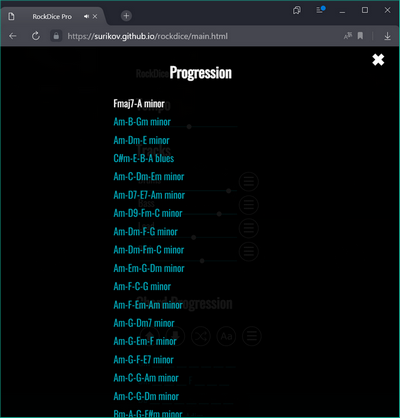

# rockdice

- Start App launcher - https://surikov.github.io/rockdice/main.html
- Source - https://github.com/surikov/rockdice

# Автогенерация музыки без AI

Автоматическое создание музыки по заданным параметрам.

- Start App launcher - https://surikov.github.io/rockdice/main.html
- Source - https://github.com/surikov/rockdice

Используется Web Audio API, TypeScript, Android WebView, таблично-волновой синтез и элементарная теория музыки.

---

Содержание:

- [Описание работы](#Описание%20работы)
  - [Похожие проекты](#Похожие%20проекты)
  - [Настройки](#Настройки)
  - [История](#История)
  - [Публикация и экспорт](#Публикация%20и%20экспорт)
- [Описание реализации](#Описание%20реализации)
  - [Воспроизведение звука](#Воспроизведение%20звука)
  - [Модуляция фрагментов](#Модуляция%20фрагментов)
  - [Специфика инструментов](#Специфика%20инструментов)
  - [Хранение состояний](#Хранение%20состояний)
  - [Разметка ссылок](#Разметка%20ссылок)
  - [Android](#Android)

# Описание работы

В основном окне можно слайдером выбрать прогрессию. Последовательность аккордов определяет настроение мелодии.
Круглыми переключателями можно выбрать риффы для стандартных 4-х слоёв мелодии
- Drums - задает ритм
- Bass - гармоническая основа и ритм
- Lead - создаёт мелодический рисунок
- Pad - контрапункт, протяжные ноты показывающие функцию аккорда
По голубой кнопке с игральным кубиком выбираются рандомные значения.

Приложение делает модуляцию выбранных фрагментов под заданные аккорды. Если покрутить переключатели и прослушать несколько мелодий, можно убедиться что при любом сочетании аккордов и инструментов музыка получается вполне "человеческое".

## Похожие проекты

Встроенные функции автогенерации аранжировок появились ещё в первых синтезаторах. Пример исполнения на Cassio MT-100 из 80-х прошлого века: 

https://www.youtube.com/watch?v=Aepm6V4yvhw

Современное приложение Captain Plugins Epic, подойдёт только профессионалам: 

https://www.youtube.com/watch?v=ZuB_t1DBwp8

Web-приложение BandLab SongStarter, никаких настроек не поддерживает, просто генерирует мелодии в одном стиле: 

https://www.youtube.com/watch?v=EDRPy8KtY0c

## Настройки

По кнопке с шестерёнкой открывается окно настроек.
Можно редактировать громкость по слоям, скорость, менять аккорды, транспонировать:

Для каждого трека можно выбрать рифф из списка:

Также можно выбрать аккордовую последовательность:

## История

Возможность отменить прошлое действие и вернуться в предидущее состояние это типовое требование для любых приложений.
По кнопке с иконкой Undo (справа вверху) открывается окно с историей подбора мелодий:

## Публикация и экспорт

Как и любое музыкальное приложение, RockDice позволяет экспортировать созданную мелодию в MIDI-файл или Wav-файл (кнопки в нижней панели).
Полученные файлы можно редактировать в других музыкальных приложениях.
Пример треков импортированных в BandLab MixEditor (любой трек можно форкнуть и открыть в редакторе):

https://www.bandlab.com/sss1024/tracks

### Совместная работа

Ссылка на мелодию открывается в приложении точно в том виде как её отправил автор.

По кнопке со стандартной иконкой Share открывается окно предпросмотра. В нём
можно отослать ссылку на мелодию через e-mail, мессенджер или соц. сети:

В большинстве соц. сетей ссылка корректно распознаётся с описанием и изображением выбранных инструментов:

# Описание реализации

## Воспроизведение звука

Для воспроизведения звука используется библиотека WebAudioFont:

https://github.com/surikov/webaudiofont

В библиотеке содержатся более 2000 оцифрованных инструментов и основные фильтры для обработки звука:

- 10-полосный эквалайзер для настройки тембра
- эхо для объёмного звучания
- динамический компрессор для выделения голосов

Документация:

https://surikov.github.io/webaudiofont/npm/src/docs/index.html

## Модуляция фрагментов

Для выбранных (или введённых вручную) аккордов в функции extractMode вычисляется тоника и лад, см.

https://github.com/surikov/rockdice/blob/main/ts/code/zvoogharmonizer.ts#L1156

Для воспроизведения музыки в проект добавлено около двухсот риффов с разными инструментами, их можно посмотреть в папке

https://github.com/surikov/rockdice/tree/main/patterns

Каждый паттерн кроме нот также содержит описание лада и тоники.

Выбранные риффы в функции  morphSchedule транспонируются в тонику выбранных аккордов и проводится модуляция в лад аккордовой прогрессии, см.

https://github.com/surikov/rockdice/blob/main/ts/code/zvoogharmonizer.ts#L377

- Транспонирование мелодии - перенос всех нот на равное количество полутонов. По-простому - сделать звук выше или ниже.
- Модуляция мелодии сдвиг определённых ступеней лада. По-простому - из минора в мажор и т.п.

## Специфика инструментов

## Хранение состояний

## Разметка ссылок

## Android

